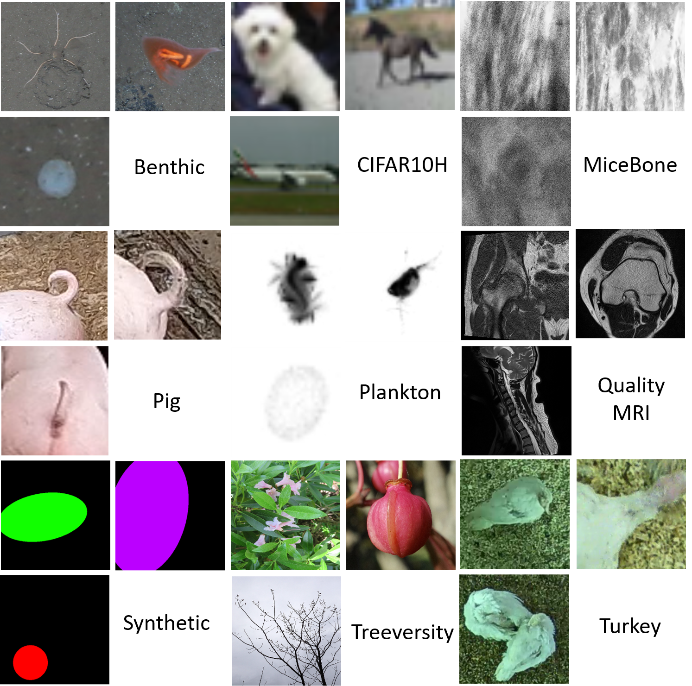
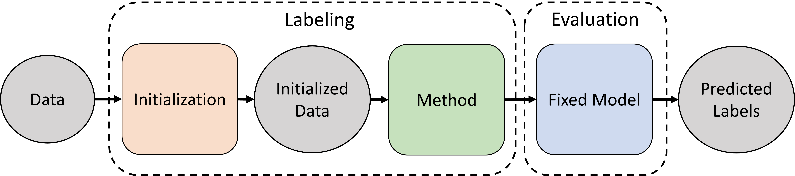

# Joined Repo Data-Centric Benchmark and Follow-up

This is the official repo of the Data-Centric Image Classification (DCIC) Benchmark.
The original paper can be found [here](https://proceedings.neurips.cc/paper_files/paper/2022/file/d6c03035b8bc551f474f040fe8607cab-Paper-Datasets_and_Benchmarks.pdf).
The goal of this benchmark is to measure the impact of tuning the dataset instead of the model for a variety of image classification datasets.

Additional Addons like [DC3](https://www.ecva.net/papers/eccv_2022/papers_ECCV/papers/136680354.pdf), [SPA, CleverLabel](https://arxiv.org/abs/2305.12811) and an [annotation strategy](https://arxiv.org/abs/2306.12189) are given [below](#addons).




## Citation

Please cite as
```
@article{schmarje2022benchmark,
    author = {Schmarje, Lars and Grossmann, Vasco and Zelenka, Claudius and Dippel, Sabine and Kiko, Rainer and Oszust, Mariusz and Pastell, Matti and Stracke, Jenny and Valros, Anna and Volkmann, Nina and Koch, Reinahrd},
    journal = {Advances in Neural Information Processing Systems},
    pages = {33215--33232},
    title = {{Is one annotation enough? A data-centric image classification benchmark for noisy and ambiguous label estimation}},
    url = {https://proceedings.neurips.cc/paper_files/paper/2022/file/d6c03035b8bc551f474f040fe8607cab-Paper-Datasets_and_Benchmarks.pdf},
    volume = {35},
    year = {2022}
}
```

Please see the full details about the used datasets below, which should also be cited as part of the license.

## Hands-On Tutorial

We provide some hands-on tutorial in Google Colab to get an understanding of the provided pipeline.

- Overview about basics, Creation of own methods and datasets [https://colab.research.google.com/drive/1Vnth3RYD0dlyT08n4CMSw5W1XRat3ver](https://colab.research.google.com/drive/1Vnth3RYD0dlyT08n4CMSw5W1XRat3ver)

## Installation

All provided code should be run with docker and thus a working docker version with GPU support is expected.
The source code is tested on a RTX 3090 with 24GB VRAM and might not work with other hardware especially with lower VRAM.

First, create an image with docker file

    docker build -t dcic .

Hint: If the command fails with a GPG error, open Dockerfile and follow the instructions in line 3.

All following docker commands should be executed within the folder of this downloaded project.

Please set the correct values for your system in `./run.sh`
This includes own [Weights & Bias](https://wandb.ai/) API Token if you want to log to their system.

Before you can use any other commands you need to check and setup the benchmark by calling
```
    ./run.sh src.util.check_and_setup
```

The raw data should be downloaded automatically to `<DATASET_ROOT>`. Please see the information about datasets at the end if you want or need to download the datasets manually.

If you run the code WITHOUT the wrapper script `run.sh` and docker you need to change the root_directory with the command line argument --data_root
You can also change the default locations of the input and evaluation datasets by specifing the corresponding command line argument
See the file `dataset_skeleton.py` for more information.

If you encounter any issues or errors, get more information from the error log on the command line.
The desired file structure after this setup is defined below.

### Folds & Slices & Splits

For every dataset the benchmark provides 5 folds which contain roughly 20% of the complete data.
These 5 folds allows a 5-fold crossvalidation. Fold 1 describes a certain fifth of the data and the slice 1 describes the dataset where fold 3-5 for trainng, fold 1 for  validation and fold 2 for test is used.
Split is the separation into training, validation, unlabeled and test.

The general pipeline is described below for one slice but can be adopted to any split by changing the <v_fold>.
In general only the v_fold 1,2,3 are evaluated to save runtime.

### Expected File structure

```
<DATASET_ROOT> # aka /data/ inside docker
 |
 ---- raw_datasets/  # A subfolder for every image included
 |        |
 |        |--- MiceBone/
 |        |    |
 |        |    |--- fold1/ # All images inside folder
 |        |    |--- fold2/
 |        |    |--- fold3/
 |        |    |--- fold4/
 |        |    |--- fold5/
 |        |    |--- annotations.json # Raw Annotations
 |        |--- Plankton/
 |        |---- ...
 |
 ---- input_datasets/ # input for the algorithms
 |       |
 |       | --- MiceBone/ # 3 files for the 3 split-datasets (see below for the defintion of split)
 |       | --- Plankton/
 |       | ---- ...
 ---- evaluate_datasets/ # evaluation datasets for the final evaluation (DO NOT use during training)
 |        |
 |        |--- MiceBone/ # 3 files for the 3 split-datasets (similar to the input dataset but with perfect gt)
 |        |--- Plankton/
 |        |---- ...
 ----- output_datasets/ # outputs of all implemented algorithms
          |
          | --- <FOLDER1> # arbitary folder name with 3 datasets based on the 3 split datasets
          | --- <FOLDER2>
          | --- ....  


```


## Usage

The benchmark is structured into two phases: Labeling and Evaluation



### 1. Labeling

In this step you can apply your own algorithm to the sliced dataset to generate a newly labeled dataset for the evaluation.

We generally work in two steps:
- initial annotations
- refine annotations

Both phases are structured an organized in the common `AlgorithmSkeleton` class.
We provide a default implementation for the intitial annotations in the method `get_initial_annotations()` and provide a dummy method `run()` for the refining of the annotations.
For more informations about implementing your own method see below.

The algorithm is applied to all specified datasets with `dataset` (default: `all` datasets used) and slices with valdidation_vald `v_fold` (default: -1, uses all slices).
Attention, you can specify less slices than 3 but the evaluation expects no gaps between the slice numbers. For example slices [1,2,4] would be evaluated wrongly.
The outputs are stored in a folder based on the `name` of the algorithm class. The output consists of all processed dataset slices which are based on the class `DatasetDCICJson`.
For more details about the parameters see `algorithm_skeleton.py`.

The initial annotations are created by using `number_annotations_per_image` annotations for a random image (in training and validation) until the `percentage_labeled_data` is reached.
The arguments can be addressed via the command line.
The annotations are taken from an `AnnotationOracle` which is described in `src/util/oracle.py`.

The refine annotations step is custom to all methods.
We provide several baselines as example and comparison which are all described in the main main paper.

Notes:
- `no_algorithm.py` use only initial annotations and thus can be used as a baseline
- `pseudo_label.py` trains a ResNet50v2 on the provided labeled data and predict the labels of all other labels. It is called Pseudo v2 in the paper and its variants can be addressed via command line arguments
- MeanTeacher, Pi Model, Fixmatch and Pseudolabel v1 (+ S2C2) were executed based on the original authors source code (TODO: Insert currently unpublished Link, Under Review). You can import the generated predictions as described below.


```
# In general the algorithm is called with
./run.sh src.algorithms.<FILE>


# Generating Baseline Results can be achieved for example with
./run.sh src.algorithms.no_algorithm

# You can add additional arguments to influence the intitial annotation and datasetsn
# these arguments are here explained nor no_algorithm but work for all algorithms

# These genereates all datasets, labeled percentage and number annotations possiblities
./run.sh src.algorithms.no_algorithm --datasets all --percentage_labeled_data -1 --number_annotations_per_image -1

# You can specify multiple datasets or specific labeled_percentage or annotations like this
./run.sh src.algorithms.no_algorithm --datasets Turkey,MiceBone,QualityMRI --percentage_labeled_data 1.0 --number_annotations_per_image 1

# Many other algorithm can be started similarly as shown below
# Pseudolabel (Predict labels of unlabeled data)
./run.sh src.algorithms.pseudo_label
# DivideMix (Mixture of Semi-Supervised Learning and Noise Estimation)
./run.sh src.algorithms.divide_mix

# If you use external scripts and need to import the predictions a loader is defined in `predictions_import`. See the file for more information
# Attention: you need to paste the predictions under <DATASET_ROOT>/manual_predictions
./run.sh src.algorithms.predictions_import --root_directory_predictions /data/manual_predictions --subset train#ema_normal --subset val#ema_normal --subset unlabeled#ema_normal --subset test#ema_normal --number_annotations_per_image -1 --percentage_labeled_data -1


```

### 2. Evaluate

The evaluation is calculated on a predefined model and hyperparameters with the given input data.

Run the evaluation inside docker with the function `./run.sh src.evaluation.evaluate`. This scripts has the following parameters:
- `folders` are the folders under `output_folder` which should be evaluated
- `output_folder` the path where the created `DatasetDCICJSON` for all specified slices and datasets are stored (default: /data/output_datasets)
- `mode` the type of input labels can be hard or soft. The loss is `Cross-entropy`for hard labels and `Kullback Leiber Divergence`for soft labels. (default: ['soft'])
- `verbose` adjust the verbosity for the evaluation, 0 only final result table, 1 results per experiment (loaded folder), 2 results per slice, 3 results per slice + training logs

The reported metrics are `kappa`, `kl`, `f1`, `acc` for the given (weighted) budget.
- `kappa` consistency score between slices which are used as input. For this calculation the class `unknown` can be ignored or considered. The default behaviour is that in the final metric the class `unknown` is considered.
- `kl` Kullback leiber divergence between soft gt and predicted output to measure the quality of soft predictions (interesting for soft labels).
- `f1` Macro F1-Score over all classes as a classification performance (interesting for hard labels).
- `acc` Is the accuracy for each class averaged over the classes to compensate for class imbalance

The classification scores like `kl,f1,acc` can be calculated on the original or provided (possibly relabeled) test data. The default behaviour is that in the final metric the original test data is used.
Furthermore additional outputs like the consistency matrices and a classification report are provided.


Example:
```
# Run evaluation on one folder in `output_datasets`
./run.sh src.evaluation.evaluate --folders <NAME> --mode soft

# ... multiple folders
./run.sh src.evaluation.evaluate --folders <NAME>,<NAME2> --mode soft


# ... with wild cards (if you provide exactly one folder)
./run.sh src.evaluation.evaluate --folders *pseudo*


# you can add additional logging to Weights & Biases
./run.sh src.evaluation.evaluate --folders *pseudo* --wandb


```

## Development

### Debug Visualization

You can visualize a dataset json file by using the visualizer like so

```
# you may use wild cards
./run.sh src.util.visualize --file /data/output_datasets/*divide_mix-01-1.00/*
```

### Tuning Hyperparameters for evaluation

The hyperparameters for the evaluation phase were determined by

```
./run.sh src.evaluation.tune --datasets <DATASET_NAME>
```

The best set of parameters was determined and inserted into `src/datasets/dataset_skeleton.py` under `hyper_parameters`.

## Contributing

### Implement your own method

If you want to implement you have to interherit from `AlgorithmSkeleton`. You can orientate yourself on the minimal working solution below.
You can other methods from `AlgorithmSkeleton` like `get_initial_annotations` or `before_all_slices_processed` to change the initial annotation scheme or for callbacks before or after certain events.

```
from absl import app
from src.algorithms.common.algorithm_skeleton import AlgorithmSkelton


class Algorithm(AlgorithmSkelton):

    def __init__(self):
        AlgorithmSkelton.__init__(self,'no_alg')

    def run(self, raw_ds, new_ds, oracle, dataset_info, v_fold):
        # put your changes here
        # you can get annotations with oracle.get_annotation(file_name,weight)
        # you can update the label with new_ds.update_image(path, split, soft_gt)

        return new_ds

def main(argv):
    """
       Apply only initial annotation
       :return:
    """

    alg = Algorithm()
    alg.apply_algorithm()


if __name__ == '__main__':
    app.run(main)
```

If you have all file names in a list `paths` and all new soft_gt values in a list `preds` you can update the dataset with the following loop inside the method run
```
    for i, path in enumerate(paths):
        split = ds.get(path,'original_split')  # determine original split before move to unlabeled
        ds.update_image(path, split, [float(temp) for temp in preds[i]])
```

### Add a new Dataset

If you want to add a new Dataset you have to implement a class which inherits from DatasetSkeleton.
You also have to register the new dataset in `src/utils/const.py` under `get_all_dataset_infos()`.

The appropriate hyperparameters during the evaluation phase have to be defined under `hyper_parameters` in `src/datasets/dataset_skeleton.py`.

## Datasets and their citation

The datasets are available at [https://doi.org/10.5281/zenodo.7152309](https://doi.org/10.5281/zenodo.7152309)

As part of the license the original works and authors of the datasets should be acknowledgement. Please add the following references to be compliant with the license:

```

@article{schoening2020Megafauna,
author = {Schoening, T and Purser, A and Langenk{\"{a}}mper, D and Suck, I and Taylor, J and Cuvelier, D and Lins, L and Simon-Lled{\'{o}}, E and Marcon, Y and Jones, D O B and Nattkemper, T and K{\"{o}}ser, K and Zurowietz, M and Greinert, J and Gomes-Pereira, J},
doi = {10.5194/bg-17-3115-2020},
journal = {Biogeosciences},
number = {12},
pages = {3115--3133},
title = {{Megafauna community assessment of polymetallic-nodule fields with cameras: platform and methodology comparison}},
volume = {17},
year = {2020}
}

@article{Langenkamper2020GearStudy,
author = {Langenk{\"{a}}mper, Daniel and van Kevelaer, Robin and Purser, Autun and Nattkemper, Tim W},
doi = {10.3389/fmars.2020.00506},
issn = {2296-7745},
journal = {Frontiers in Marine Science},
title = {{Gear-Induced Concept Drift in Marine Images and Its Effect on Deep Learning Classification}},
volume = {7},
year = {2020}
}


@article{peterson2019cifar10h,
author = {Peterson, Joshua and Battleday, Ruairidh and Griffiths, Thomas and Russakovsky, Olga},
doi = {10.1109/ICCV.2019.00971},
issn = {15505499},
journal = {Proceedings of the IEEE International Conference on Computer Vision},
pages = {9616--9625},
title = {{Human uncertainty makes classification more robust}},
volume = {2019-Octob},
year = {2019}
}

@article{schmarje2019,
author = {Schmarje, Lars and Zelenka, Claudius and Geisen, Ulf and Gl{\"{u}}er, Claus-C. and Koch, Reinhard},
doi = {10.1007/978-3-030-33676-9_26},
issn = {23318422},
journal = {DAGM German Conference of Pattern Regocnition},
number = {November},
pages = {374--386},
publisher = {Springer},
title = {{2D and 3D Segmentation of uncertain local collagen fiber orientations in SHG microscopy}},
volume = {11824 LNCS},
year = {2019}
}

@article{schmarje2021foc,
author = {Schmarje, Lars and Br{\"{u}}nger, Johannes and Santarossa, Monty and Schr{\"{o}}der, Simon-Martin and Kiko, Rainer and Koch, Reinhard},
doi = {10.3390/s21196661},
issn = {1424-8220},
journal = {Sensors},
number = {19},
pages = {6661},
title = {{Fuzzy Overclustering: Semi-Supervised Classification of Fuzzy Labels with Overclustering and Inverse Cross-Entropy}},
volume = {21},
year = {2021}
}

@article{schmarje2022dc3,
author = {Schmarje, Lars and Santarossa, Monty and Schr{\"{o}}der, Simon-Martin and Zelenka, Claudius and Kiko, Rainer and Stracke, Jenny and Volkmann, Nina and Koch, Reinhard},
journal = {Proceedings of the European Conference on Computer Vision (ECCV)},
title = {{A data-centric approach for improving ambiguous labels with combined semi-supervised classification and clustering}},
year = {2022}
}


@article{obuchowicz2020qualityMRI,
author = {Obuchowicz, Rafal and Oszust, Mariusz and Piorkowski, Adam},
doi = {10.1186/s12880-020-00505-z},
issn = {1471-2342},
journal = {BMC Medical Imaging},
number = {1},
pages = {109},
title = {{Interobserver variability in quality assessment of magnetic resonance images}},
volume = {20},
year = {2020}
}


@article{stepien2021cnnQuality,
author = {St{\c{e}}pie{\'{n}}, Igor and Obuchowicz, Rafa{\l} and Pi{\'{o}}rkowski, Adam and Oszust, Mariusz},
doi = {10.3390/s21041043},
issn = {1424-8220},
journal = {Sensors},
number = {4},
title = {{Fusion of Deep Convolutional Neural Networks for No-Reference Magnetic Resonance Image Quality Assessment}},
volume = {21},
year = {2021}
}

@article{volkmann2021turkeys,
author = {Volkmann, Nina and Br{\"{u}}nger, Johannes and Stracke, Jenny and Zelenka, Claudius and Koch, Reinhard and Kemper, Nicole and Spindler, Birgit},
doi = {10.3390/ani11092655},
journal = {Animals 2021},
pages = {1--13},
title = {{Learn to train: Improving training data for a neural network to detect pecking injuries in turkeys}},
volume = {11},
year = {2021}
}

@article{volkmann2022keypoint,
author = {Volkmann, Nina and Zelenka, Claudius and Devaraju, Archana Malavalli and Br{\"{u}}nger, Johannes and Stracke, Jenny and Spindler, Birgit and Kemper, Nicole and Koch, Reinhard},
doi = {10.3390/s22145188},
issn = {1424-8220},
journal = {Sensors},
number = {14},
pages = {5188},
title = {{Keypoint Detection for Injury Identification during Turkey Husbandry Using Neural Networks}},
volume = {22},
year = {2022}
}


```


## Addons

### DC3

[TODO] Reimplementation of the original [repository](https://github.com/Emprime/dc3) still under development

Please cite as
```
@inproceedings{schmarje2022dc3,
  title={A data-centric approach for improving ambiguous labels with combined semi-supervised classification and clustering},
  author={Schmarje, Lars and Santarossa, Monty and Schr{\\"o}der, Simon-Martin and Zelenka, Claudius and Kiko, Rainer and Stracke, Jenny and Volkmann, Nina and Koch, Reinhard},
  booktitle={European Conference on Computer Vision},
  pages={363--380},
  year={2022},
  organization={Springer}
}
```

### Annotation Server

[TODO] Run annotation server directly from this first stage, currently under development


### Analyse

This script allows to summarize and evaluate the generated results which are stored in `evaluation_logs`.
It also may generate plots of the results which are stored in the folder `images` in the `evaluation_logs`folder.

Overall, the script seems to be designed to analyze and visualize data using the `DCICReport` object and the `analyze` function. The `analyze`function can be called manually or via a command-line interface for generating different visualizations based on user input.

 The `analyze` function is responsible for grouping, analyzing, and visualizing data based on specified parameters.
    It takes in a DCICReport instance, experiment name, dataset groups and selections, method groups and selections, annotation selections, score names, and various optional parameters.
    
 
 
 #### Static function call of `analyze`
 
 Based on the following example call of `analyze` the usage of all parameters will be explained
 
 ```
 analyze(report, "1_more_annotations-0",
            dataset=grouped_datasets,
            method=grouped_methods,
            annos="01-0.10,01-0.20,01-0.50,01-1.00,03-1.00,05-1.00,10-1.00",
            score_names=['kl', 'ece', 'macro_acc', 'macro_f1', 'input_consistency'],
            value_normalization='absolute', x_axis='budget', y_axis='metric',
            markers=[''])
 ```
 
 Here's an explanation of each parameter:

  - `report`: It is an instance of the DCICReport class that contains the data to be analyzed.
    "1_more_annotations-0": It is the name of the experiment or visualization.
  - `dataset`: It specifies the dataset groups and selections. The variable - grouped_datasets contains a string with comma-separated values representing different groups and dots representing groupings within a group. A result will be calculated for each comma seperated groupd while the results will be aggregated for each dot seperated group.
  - `method`: It specifies the method groups and selections. The variable grouped_methods  contains a string with comma-separated values representing different groups and dots representing groupings within a group. A result will be calculated for each comma seperated groupd while the results will be aggregated for each dot seperated group.
  - `annos`: It specifies the annotation selections. The annotations are specified with two parts separated by a hyphen. The first part represents the number of annotations, and the second part represents the degree of supervision during the initialization.
  - `score_names`: It is a list of score names to be analyzed and visualized Possible values: =['kl', 'ece', 'macro_acc', 'macro_f1', 'input_consistency', 'input_ece','input_kl','input_macro_acc', 'input_macro_f1']
  - `value_normalization`: It specifies the type of value normalization to be used. In this case, the values will be normalized as absolute values.  Options are 'absolute' (absolute values), 'relative_baseline' (relative to baseline), and 'relative_anno' (relative to the first annotation). 
  - `x_axis`: It specifies the data to be plotted on the x-axis.  Possible values are 'annos', 'dataset', 'method', or 'budget'.
  - `y_axis`: It specifies the data to be plotted on the y-axis. Possible values are 'metric', 'dataset', or 'method'.
  - `markers: It is a list of markers to be used between different configurations on the y-axis. If none are given the default values will be used.
 
 
 #### Interactive CLI

The interactive CLI tool provided allows users to generate visualizations quickly and easily by specifying the desired parameters. Here's an explanation of how users can utilize this tool:

1.  Launch the CLI tool: Run the script containing the provided code in a Python environment or IDE.

2.  Define the visualization: The tool will prompt you to define the next visualization. Enter the required parameters in the following format: "name/dataset/method/annos/score_name/[Options]".
    - Name: Provide a name for the visualization. This can be any descriptive name of your choice.
    - Dataset: Specify the dataset(s) to include in the visualization. You can choose from predefined options such as "all," "grouped," "easy," or "diff." Alternatively, you can input your own dataset(s).
    - Method: Select the method(s) to include in the visualization. Similar to datasets, you can choose from predefined options such as "ssl_methods," "self_methods," "noise_methods," etc. You can also input your own method(s).
    -  Annos: Define the annotation(s) to include in the visualization. Options include "full," "supervised," or "semi." Alternatively, you can input your own annotation(s).
        Score_name: Specify the score name to analyze and visualize.
     -   Options (optional): Additional options can be provided to customize the visualization. These options should be provided as comma-separated key-value pairs, where each pair represents an optional parameter and its value. Available options include "value_normalization," "x_axis," "y_axis," "mean_stds," and "short." For example, "value_normalization=absolute,x_axis=budget,mean_stds=True."

 3. Generate the visualization: Once you have defined the visualization parameters, the tool will generate the corresponding visualization based on the provided inputs. The visualization will be displayed or saved, depending on the implementation of the create_plots function.

4.  Repeat or abort: After generating a visualization, the tool will prompt you again to define the next visualization. You can repeat the process and define as many visualizations as needed. If you wish to exit the tool, simply enter "abort" when prompted.

By using this interactive CLI tool, users can quickly explore and analyze different datasets, methods, annotations, and score names without modifying the underlying code. It provides a convenient and efficient way to generate visualizations for data analysis purposes.


### ViT Evaluation

The class `src/evaluation/vit.py` is a direct replacement for the normal evaluation script `src/evaluation/evaluate.py`.
The difference is that instead of a tuned CNN per dataset a general Vision Transformer is used.
This evaluation was used in the CleverLABEL paper [https://arxiv.org/abs/2305.12811](https://arxiv.org/abs/2305.12811) to illustrate the benefit of a more sophisticated backbone to handle issue like saturation from the CNN models while the input quality was getting better.
Due to the fact that it is a replacement, you can use all parameters and setups as before.
The script will inlcude a `_vit` after the method name to highlight the different type of evaluation protocol.

### SPA + CleverLABEL

The `SimulatedProposalAcceptance` class implements the proposed SPA and CleverLABL algorithm form [https://arxiv.org/abs/2305.12811](https://arxiv.org/abs/2305.12811).

- Initialization: Create an instance of the SimulatedProposalAcceptance class by providing the raw_name as a parameter. Optionally, you can pass a report for tracking evaluation results.

- Applying the Algorithm: Call the apply_algorithm method to execute the main algorithm. This method overrides the base class method and allows estimation based on the folder name. It iterates over slices, loads the proposed dataset, sets up the original dataset, initializes the oracle, retrieves initial annotations, and applies the main algorithm by calling the run method.

- Running the Algorithm: The run method is responsible for executing the main algorithm. It iterates over the proposed dataset, processes each image, and updates the dataset with estimated distributions. It also prints debug information about the final budget and KL divergence. The algorithm's behavior is influenced by various global variables defined with FLAGS prefix, such as FLAGS.simulation_repetition, FLAGS.enable_annotate_unlabeled_data, FLAGS.blending_coefficient, and others.

- Simulation of Proposal Acceptance: The simulate_proposal_acceptance method is used to simulate proposal acceptance. It takes the proposed class, oracle, simulation repetitions, path, and other parameters as input. This method applies the SPA (Simulated Proposal Acceptance) technique, which includes estimating proposal acceptance based on simulated probabilities, incorporating the blending coefficient (equivalent to μ in the paper), and optionally correcting with an offset (equivalent to δ for the CleverLabel part).

Please cite as

```
@article{schmarje2023spa,
author = {Schmarje, Lars and Grossmann, Vasco and Michels, Tim and Nazarenus, Jakob and Santarossa, Monty and Zelenka, Claudius and Koch, Reinhard},
journal = {arXiv preprint arXiv:2305.12811},
title = {{Label Smarter, Not Harder: CleverLabel for Faster Annotation of Ambiguous Image Classification with Higher Quality}},
year = {2023}
}

}
```


### Verse

This is the implementation of the Verse Proposal Study presented in [https://arxiv.org/abs/2306.12189](https://arxiv.org/abs/2306.12189).
The method `vps.py` implemets the loading of different combinations of annotations from this study.
The loaded results are then corrected with CleverLabel and used for the evaluation as common in the benchmark.
The parameters of this method are `tags, blending_coefficient and dataset_coefficient`.
The last two are parameters from the CleverLabel paper and are explained in the help function of the method and in the paper.
`tags` describe what kind of configuration of annotations should be loaded.
We provide 4 different setups:
- `no_0to9` all valid annotations without proposals, this can be seen as the ground-truth and was used also to generate the ground-truth labels in the dataset
- `dc3_0to9` all valid annotations with proposals, this is the main comparison with DC3 proposals
- `dc3_0to2_6to9` all valid annotations with proposals (excluding the iteration with probabilistic overclustering proposals), this is a setup for comparison without this feature (see [TODO reference will be added on publication])
- `dc3_neg2to9` all valid annotations with proposals (including the training annotations), the training annotations were often quite good and were just ruled out by the setup, however they can be used

The proposals and the class distributions are given in the auxilary file `src/algorithms/vps_files/proposals.py`.

The original split in training, validation and test is kept, thus no 5 folds are possible. For this reason all executions with these datasets should only be executed on `v_fold 3`.

The data can be downloaded from [https://doi.org/10.5281/zenodo.7152309](https://doi.org/10.5281/zenodo.7152309) and is included in the automatic setup

Please cite as

```
@article{schmarje2023vps,
author = {Schmarje, Lars and Grossmann, Vasco and Zelenka, Claudius and Koch, Reinhard},
journal = {arXiv preprint arXiv:2306.12189},
title = {{Annotating Ambiguous Images: General Annotation Strategy for Image Classification with Real-World Biomedical Validation on Vertebral Fracture Diagnosis}},
year = {2023}
}

}
```
